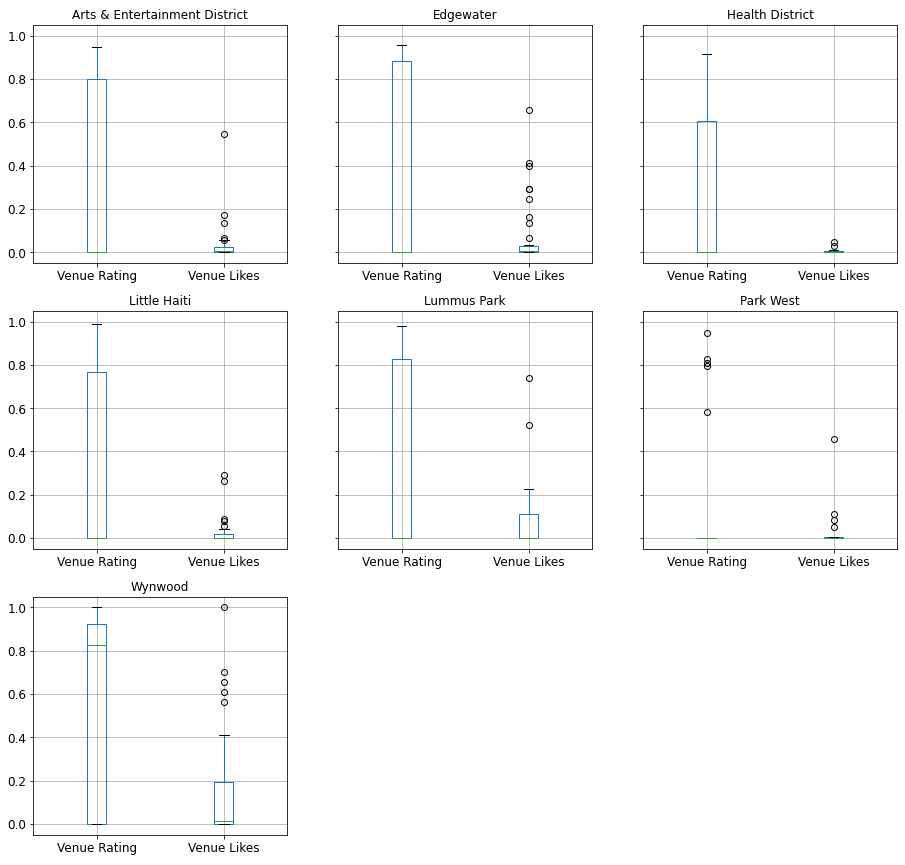

\pagebreak

## Summary

* Introduction
  * Business understanding
    * Project goals
  * Analytic approach
* Data
  * Data requirements
* Methodology
  * Data collection
  * Data understanding
  * Data preparation
    * Cleansing, transforming and feature engineering
  * Exploratory Data Analysis
* Results
* Discussion
* Conclusion

## Introduction

### Business understanding - Opening a Basque Pintxos bar

The objective of this project is to find the best spot for our restaurant. We need to search for similar cuisine restaurants in an affordable neighborhood. It's a family business looking forward to expand its reach to the United States, particularly in Miami city. The goal is to find a cheap place to rent, and focus on getting local quality ingredients. The main ingredient for the menu will be fish, so we need to be near other restaurants alike.

### Analytic approach

Foursquare's data will help us decide a neighborhood to start our new business, by getting the venues for each neighborhood, filtering out not crowded areas and search for patterns, are there neighborhoods with similar cuisine to ours? Then we sort them by user's rating. This project aims to get a sorted list of neighborhoods to search places to rent.

## Data

### Data requirements: find restaurants alike

It is very important to have a relationship with nearby restaurants with the same goals. We need to find a neighborhood where the main ingredient is fish. This could help on getting in touch with local suppliers.

We will have to use multiple Foursquare API endpoints:

* Venues search: query all Miami neighborhoods restaurants
* Venues explore: find a location where the recommended restaurants main dish is fish
* Venues categories: find resturants of similar cuisine
* Venues similar: find a reference restaurant and the find similar restaurants
* Venues details: look for restaurants with high likes ranking

First we need to cluster all Miami neighborhoods by similar cuisine and find if there is a pattern. If there is a pattern, explore all recommended venues near a cluster centroid. If there is not a pattern, query all the categories and find a similar one, then select the neighborhood with the maximum frequency for the selected category.

We can find similar restaurants in other neighborhoods and sort them by like ranking, searching through its details.

All this data could help us decide a neighborhood with restaurants with similar cuisine and high ratings.

\pagebreak

## Methodology

### Data collection

First we collect **all** *Miami City* **neighborhoods** from [Wikipedia](https://en.wikipedia.org/wiki/List_of_neighborhoods_in_Miami).

\pagebreak

Searching for **food venues** on *Foursquare*, we obtain a list of **680** from *23* Miami neighborhoods of the *25* in Miami city.

After some initial insights, we observe clearly which neighborhoods are not crowded or far from the city center.

We need additional data to decide which neighborhoods suit our needs:

* Near venues with similar cuisine
* User's rating
* User's number of likes

\pagebreak

### Data understanding

After reviewing neighborhoods with just a few food venues or with very different cuisine, we discard the following:

* Coconut Grove
* Coral Way
* The Roads
* Grapeland Heights
* Allapattah
* Liberty City

Then we search for the top 5 venues for the selected neighborhoods.

|    | Neighborhood                  | 1                               | 2                    | 3                   | 4                         | 5                             |
|---:|:------------------------------|:--------------------------------|:---------------------|:--------------------|:--------------------------|:------------------------------|
|  0 | Arts & Entertainment District | Food Truck                      | Restaurant           | Pizza Place         | Ice Cream Shop            | Bakery                        |
|  1 | Brickell                      | American Restaurant             | Coffee Shop          | Japanese Restaurant | Café                      | Mediterranean Restaurant      |
|  2 | Buena Vista                   | Coffee Shop                     | Fast Food Restaurant | Italian Restaurant  | Ice Cream Shop            | Restaurant                    |
|  3 | Design District               | Coffee Shop                     | Italian Restaurant   | Ice Cream Shop      | Restaurant                | Fast Food Restaurant          |
|  4 | Downtown                      | Coffee Shop                     | Italian Restaurant   | Peruvian Restaurant | Café                      | Latin American Restaurant     |
|  5 | Edgewater                     | Restaurant                      | Food Truck           | Juice Bar           | Bakery                    | Latin American Restaurant     |
|  6 | Flagami                       | Bakery                          | Seafood Restaurant   | Spanish Restaurant  | Cuban Restaurant          | Latin American Restaurant     |
|  7 | Health District               | Sandwich Place                  | Café                 | Bakery              | Restaurant                | Latin American Restaurant     |
|  8 | Little Haiti                  | Chinese Restaurant              | Food                 | BBQ Joint           | Italian Restaurant        | Ice Cream Shop                |
|  9 | Little Havana                 | Latin American Restaurant       | Food                 | Bakery              | Café                      | Mexican Restaurant            |
| 10 | Lummus Park                   | Seafood Restaurant              | American Restaurant  | Food Truck          | Restaurant                | Deli / Bodega                 |
| 11 | Midtown                       | Restaurant                      | Coffee Shop          | Breakfast Spot      | Fast Food Restaurant      | Sports Bar                    |
| 12 | Overtown                      | Southern / Soul Food Restaurant | Restaurant           | Ice Cream Shop      | Food                      | Pizza Place                   |
| 13 | Park West                     | Restaurant                      | Café                 | Pizza Place         | Food Truck                | Latin American Restaurant     |
| 14 | Upper Eastside                | Italian Restaurant              | Coffee Shop          | Snack Place         | Pizza Place               | Vegetarian / Vegan Restaurant |
| 15 | West Flagler                  | Cuban Restaurant                | Mexican Restaurant   | Food                | Latin American Restaurant | Bakery                        |
| 16 | Wynwood                       | Asian Restaurant                | Restaurant           | Ice Cream Shop      | Mexican Restaurant        | Peruvian Restaurant           |

\pagebreak

To reduce the number of neighborhods and help us find a pattern, we use **K-means** clustering from *Scikit-learn* library to obtain clusters of similar cuisine. We have decided to group the venues in **5** clusters.

#### 1st cluster

|    | Neighborhood    | 1                  | 2                   | 3                             | 4                    | 5                         |
|---:|:----------------|:-------------------|:--------------------|:------------------------------|:---------------------|:--------------------------|
|  2 | Brickell        | Coffee Shop        | Japanese Restaurant | Café                          | American Restaurant  | Mediterranean Restaurant  |
|  3 | Buena Vista     | Coffee Shop        | Italian Restaurant  | Breakfast Spot                | Fast Food Restaurant | Sushi Restaurant          |
|  6 | Design District | Coffee Shop        | Italian Restaurant  | Breakfast Spot                | Sushi Restaurant     | American Restaurant       |
|  7 | Downtown        | Coffee Shop        | Peruvian Restaurant | Italian Restaurant            | Taco Place           | Latin American Restaurant |
| 16 | Midtown         | Coffee Shop        | Restaurant          | Fast Food Restaurant          | Pizza Place          | Breakfast Spot            |
| 20 | Upper Eastside  | Italian Restaurant | Coffee Shop         | Vegetarian / Vegan Restaurant | Asian Restaurant     | Pizza Place               |

#### 2nd cluster

|    | Neighborhood   | 1      | 2                  | 3                  | 4                | 5                         |
|---:|:---------------|:-------|:-------------------|:-------------------|:-----------------|:--------------------------|
|  9 | Flagami        | Bakery | Seafood Restaurant | Spanish Restaurant | Cuban Restaurant | Latin American Restaurant |

\pagebreak

#### 3rd cluster

|    | Neighborhood   | 1                | 2                         | 3      | 4                         | 5                  |
|---:|:---------------|:-----------------|:--------------------------|:-------|:--------------------------|:-------------------|
| 14 | Little Havana  | Food             | Latin American Restaurant | Bakery | Cuban Restaurant          | Mexican Restaurant |
| 23 | West Flagler   | Cuban Restaurant | Mexican Restaurant        | Food   | Latin American Restaurant | Bakery             |

#### 4th cluster

|    | Neighborhood                  | 1                  | 2                   | 3              | 4                    | 5                         |
|---:|:------------------------------|:-------------------|:--------------------|:---------------|:---------------------|:--------------------------|
|  1 | Arts & Entertainment District | Food Truck         | Restaurant          | Pizza Place    | Ice Cream Shop       | Juice Bar                 |
|  8 | Edgewater                     | Food Truck         | Restaurant          | Juice Bar      | Bakery               | Greek Restaurant          |
| 11 | Health District               | Sandwich Place     | Café                | Bakery         | Fast Food Restaurant | Latin American Restaurant |
| 13 | Little Haiti                  | Ice Cream Shop     | Chinese Restaurant  | Food           | Italian Restaurant   | BBQ Joint                 |
| 15 | Lummus Park                   | Seafood Restaurant | American Restaurant | Food Truck     | Restaurant           | Deli / Bodega             |
| 18 | Park West                     | Restaurant         | Café                | Pizza Place    | Italian Restaurant   | Food Truck                |
| 24 | Wynwood                       | Asian Restaurant   | Restaurant          | Ice Cream Shop | Mexican Restaurant   | Peruvian Restaurant       |

#### 5h cluster

|    | Neighborhood   | 1                               | 2          | 3              | 4    | 5           |
|---:|:---------------|:--------------------------------|:-----------|:---------------|:-----|:------------|
| 17 | Overtown       | Southern / Soul Food Restaurant | Restaurant | Ice Cream Shop | Food | Pizza Place |

As we can see in the data, the neighborhoods with similar cuisine are on the 1st and 4th clusters. The 4th cluster includes more neighborhoods that are similar to ours. The 1st cluster is far from crowded venues and not very similar, being coffee places the most common type of venue.

Regarding our needs, the 4th cluster neighborhoods seems like a good place to start.

\pagebreak

### Data preparation

#### Cleansing, transforming and feature engineering

Selected neighborhoods:

| Neighborhood                  |
|:------------------------------|
| Arts & Entertainment District |
| Edgewater                     |
| Health District               |
| Little Haiti                  |
| Lummus Park                   |
| Park West                     |
| Wynwood                       |

Discard non restaurant venues:

* Bakery
* Cupcake Shop
* Café
* Ice Cream Shop
* Bagel Shop
* Smoothie Shop
* Coffee Shop
* Hotel
* Pie Shop
* Gift Shop
* Record Shop
* Cafeteria
* Event Space

\pagebreak

Now we go back to *Data Collection* to obtain Venue ratings and likes for the selected neighborhoods.

|    | Neighborhood                  | Venue                           |   Venue Rating |   Venue Likes |
|---:|:------------------------------|:--------------------------------|---------------:|--------------:|
|  0 | Arts & Entertainment District | Amor Di Pasta                   |            0   |             4 |
|  1 | Arts & Entertainment District | L&R grocery                     |            0   |             1 |
|  2 | Arts & Entertainment District | Green G Juice Bar               |            7.3 |            11 |
|  3 | Arts & Entertainment District | Fuchai Chinese & Korean Kitchen |            0   |             6 |
|  4 | Arts & Entertainment District | Latin Cafe Biscayne             |            0   |             3 |
|  5 | Arts & Entertainment District | Mulberry1965 Pizza Truck        |            0   |             1 |
|  6 | Arts & Entertainment District | Rice Mediterranean Kitchen      |            0   |             1 |
|  7 | Arts & Entertainment District | Mister O1 Extraordinary Pizza   |            8.8 |            32 |
|  8 | Arts & Entertainment District | Nostimo Greek Kitchen           |            0   |             1 |
|  9 | Arts & Entertainment District | cevishiro                       |            0   |             3 |
|... |...                            |...                              |...             |...            |

We observe a large number of venues with high ratings on Wynwood and Edgewater, also on Lummus Park.

\pagebreak

### Exploratory Data Analysis

|        | Neighborhood   | Venue   |
|:-------|:---------------|:--------|
| count  | 239            | 239     |
| unique | 7              | 208     |
| top    | Edgewater      | Doma    |
| freq   | 41             | 3       |

We have now a total of 239 venues on the 7 selected neighborhoods.

|       |   Venue Rating |   Venue Likes |
|:------|---------------:|--------------:|
| count |      239       |      239      |
| mean  |        2.80837 |       33.0335 |
| std   |        3.86376 |       83.2379 |
| min   |        0       |        0      |
| 25%   |        0       |        0      |
| 50%   |        0       |        1      |
| 75%   |        7.5     |       13      |
| max   |        9.3     |      565      |

The rating mean is very low, mainly because some of the venues don't have a rating, this does not mean that are bad venues,
but it probably means that are not very popular among Foursquare users.

\pagebreak

\pagebreak

We observe clearly on the images some Venue Likes outliers, not very consistent, unlike Venue Rating. The **median** on **Wynwood** is *high*, it seems promising.

\pagebreak

#### Correlation between Likes and Rating

|              |   Venue Rating |
|:-------------|---------------:|
| Venue Likes  |       0.575795 |
| Venue Rating |       1        |

The Pearson Correlation Coefficient is 0.5757952652873445 with a P-value of P = 1.6659918040644605e-22

The data is telling us that there is a strong certainty of correlation with a moderate positive relationship.

\pagebreak

#### Correlation between neighborhood and Rating

\

Chi-square = 0.6501489066631156  P-value = 0.999998758598854

There is no certainty of correlation between neighborhood and rating, it **does not reject the null hypothesis** that the two variables are independant, so **no evidence of association**.

\pagebreak

## Results

| Neighborhood                  |   ('Venue Rating', 'mean') |   ('Venue Rating', 'count') |   ('Venue Likes', 'mean') |   ('Venue Likes', 'count') |
|:------------------------------|---------------------------:|----------------------------:|--------------------------:|---------------------------:|
| Wynwood                       |                   4.78537  |                          41 |                  84.1707  |                         41 |
| Edgewater                     |                   3.15854  |                          41 |                  39.561   |                         41 |
| Arts & Entertainment District |                   2.77714  |                          35 |                  19.5143  |                         35 |
| Lummus Park                   |                   2.7619   |                          21 |                  52.0476  |                         21 |
| Little Haiti                  |                   2.75833  |                          36 |                  15.2778  |                         36 |
| Health District               |                   2.00741  |                          27 |                   2.62963 |                         27 |
| Park West                     |                   0.968421 |                          38 |                  11.1842  |                         38 |

With this data we could start to search for a place to rent on **Wynwood**, it seems like a popular neighborhood, **Edgewater** also seems promising

It is true that we could not find evidence of association between neighborhood and rating, but, because we are interested on crowded neighborhoods, **Wynwood** and **Edgewater** are very good options.

## Discussion

Further work could be done on data sourcing, to try to obtain more data on Venue Rating and Likes, from other APIs, with enough data we could discard venues without ratings and maybe find a relationship between neighborhood and venue rating.

## Conclussion

In this project we study and analyze *Foursquare* data on *Miami* venues, to try to find a good spot for our restaurant. First we had to obtain all the *Miami* neighborhoods and the its food venues, applying Machine Learning *k-means* clustering algorithm, we obtain *5* groups of venues with similar cuisine, this help us to discard some neighborhoods and all its venues.

We use *descriptive statistics* to describe its basic features of the data set, to show a short summary about the sample and measures of the data. The *Box plots* tells us that the data is not very consistent and that contains several *outliers*, its not perfect, nevertheless, we are confident that the results are sufficient to make a good decision. After all the *exploratory analysis*, we have found a few candidate neighborhoods.